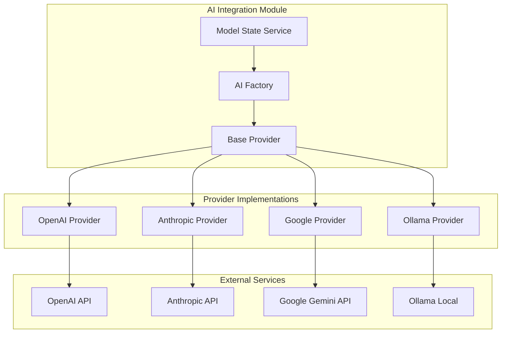

# AI Integration Module - Design Document

## Overview

The AI Integration module implements a provider-agnostic architecture for connecting to multiple AI services. It uses a factory pattern with standardized interfaces to ensure consistent behavior across different providers while accommodating their unique capabilities and requirements.

## Architecture

### Component Structure



### Factory Pattern Implementation

#### AI Provider Factory
Central factory for creating provider instances with unified interface.

```javascript
class AIProviderFactory {
    static createStreamingLLM(provider, options) {
        const ProviderClass = PROVIDER_MAP[provider];
        if (!ProviderClass) {
            throw new Error(`Provider ${provider} not supported`);
        }
        return new ProviderClass(options);
    }
}
```

#### Base Provider Interface
Standardized interface that all providers must implement.

```javascript
class BaseAIProvider {
    async streamChat(messages, options) {
        // Must return ReadableStream with SSE format
    }
    
    async validateApiKey(apiKey) {
        // Must return boolean validation result
    }
    
    getAvailableModels() {
        // Must return array of supported models
    }
    
    supportsMultimodal() {
        // Must return boolean capability indicator
    }
}
```

### Provider-Specific Implementations

#### OpenAI Provider
Implements OpenAI GPT models with vision support.

**Features:**
- GPT-3.5, GPT-4, GPT-4V model support
- Streaming chat completions
- Vision API integration
- Function calling support
- Error handling for rate limits and quotas

#### Anthropic Provider
Implements Claude models with text-focused capabilities.

**Features:**
- Claude 3 model family support
- Streaming message API
- Large context window handling
- Safety filtering integration
- Anthropic-specific message formatting

#### Google Provider
Implements Gemini models with multimodal capabilities.

**Features:**
- Gemini Pro and Ultra model support
- Text and vision processing
- Streaming generate content API
- Safety settings configuration
- Google AI Studio integration

#### Ollama Provider
Implements local model support through Ollama.

**Features:**
- Local model management
- Model downloading and caching
- Custom model support
- Offline operation
- Performance optimization for local inference

### Model State Management

#### Model State Service
Centralized service for managing AI model configuration and state.

**Responsibilities:**
- API key secure storage and retrieval
- Model selection and validation
- Provider availability checking
- Configuration persistence
- State synchronization across components

**Key Methods:**
```javascript
class ModelStateService {
    async setApiKey(provider, apiKey)
    async getApiKey(provider)
    async setSelectedModel(type, modelId)
    async getCurrentModelInfo(type)
    async validateProviderConnection(provider)
}
```

### Streaming Response Handling

#### Unified Streaming Interface
Consistent streaming response format across all providers.

**Stream Format:**
```javascript
// Server-Sent Events format
data: {"choices":[{"delta":{"content":"token"}}]}
data: [DONE]
```

**Stream Processing:**
1. Provider-specific API response normalization
2. Consistent SSE format conversion
3. Error handling and recovery
4. Cancellation support
5. Progress tracking

### Error Handling Strategy

#### Error Categories and Responses

**Network Errors:**
- Connection timeouts → Retry with exponential backoff
- DNS resolution failures → Check connectivity, suggest alternatives
- SSL/TLS errors → Validate certificates, update configuration

**Authentication Errors:**
- Invalid API keys → Prompt for reconfiguration
- Expired tokens → Automatic refresh if supported
- Quota exceeded → Show usage limits, suggest alternatives

**Provider-Specific Errors:**
- Rate limiting → Queue requests, show wait times
- Model unavailable → Suggest alternative models
- Content filtering → Explain restrictions, suggest modifications

**System Errors:**
- Memory exhaustion → Reduce batch sizes, cleanup resources
- Disk space → Clear caches, suggest cleanup
- Permission denied → Guide user through permission setup

### Performance Optimizations

#### Connection Management
- HTTP/2 connection reuse
- Connection pooling for multiple requests
- Keep-alive optimization
- DNS caching

#### Request Optimization
- Request batching where supported
- Compression for large payloads
- Streaming for real-time responses
- Caching for repeated requests

#### Memory Management
- Stream processing to avoid large buffers
- Automatic cleanup of completed requests
- Memory monitoring and alerts
- Garbage collection optimization

## Security Considerations

### API Key Protection
- Encryption at rest using Electron's safeStorage
- Memory protection during processing
- Secure transmission over HTTPS
- Automatic cleanup after use

### Request Security
- Input sanitization and validation
- Output filtering for sensitive content
- Rate limiting to prevent abuse
- Audit logging for security events

### Privacy Protection
- Local processing when possible
- Minimal data transmission
- User consent for cloud processing
- Data retention control