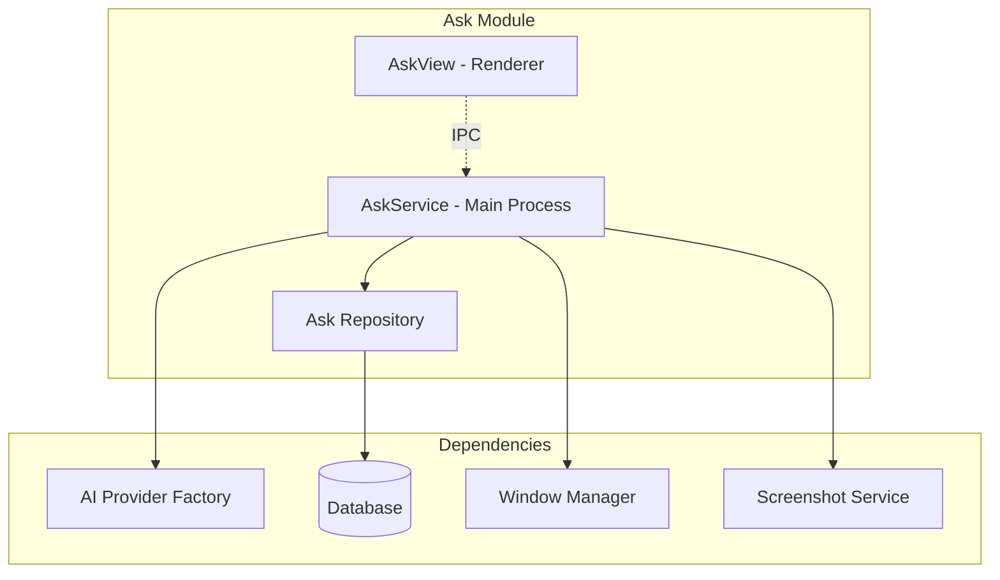

# Ask Feature Module - Design Document

## Overview

The Ask feature module implements the core AI chat functionality through a service-oriented architecture. It consists of the AskService (main process) and AskView (renderer process) components, with seamless integration to the AI provider factory and database layer.

## Architecture

### Component Structure



### Service Layer Design

#### AskService Class
Central service managing all Ask feature functionality.

**State Management:**
```javascript
state = {
    isVisible: boolean,
    isLoading: boolean,
    isStreaming: boolean,
    currentQuestion: string,
    currentResponse: string,
    showTextInput: boolean
}
```

**Key Methods:**
- `sendMessage(userPrompt, conversationHistory)`: Process user input and generate AI response
- `toggleAskButton(inputScreenOnly)`: Handle window visibility and input modes
- `closeAskWindow()`: Clean shutdown with state reset
- `captureScreenshot(options)`: Capture and process screen context

### UI Layer Design

#### AskView Component
Lit-based web component handling the chat interface.

**Features:**
- Real-time message streaming display
- Syntax highlighting for code blocks
- Keyboard shortcut handling
- Responsive layout with smooth animations
- Error state management

### Data Flow

#### Message Processing Flow
1. User types message in AskView
2. AskView sends IPC message to AskService
3. AskService captures screenshot for context
4. AskService routes to appropriate AI provider
5. AI provider streams response back
6. AskService processes stream and updates state
7. AskView receives state updates and renders response
8. Final response saved to database via repository

#### Screenshot Integration Flow
1. AskService captures screenshot before AI call
2. Image optimized (resized, compressed) if Sharp available
3. Screenshot encoded as base64 for AI provider
4. Multimodal providers receive image + text
5. Text-only providers receive text with fallback handling
6. Screenshot cached for potential retry scenarios

## Error Handling

### Error Categories
1. **Network Errors**: API timeouts, connection failures
2. **Authentication Errors**: Invalid API keys, quota exceeded  
3. **Provider Errors**: Model unavailable, unsupported features
4. **System Errors**: Screenshot capture failures, database errors

### Fallback Strategies
- **Multimodal Fallback**: Retry text-only if image requests fail
- **Provider Switching**: Automatic fallback to alternative providers
- **Graceful Degradation**: Continue without screenshots if capture fails
- **State Recovery**: Restore UI state after errors

## Performance Optimizations

### Memory Management
- Abort controllers for cancelling in-flight requests
- Stream processing to avoid large response buffering
- Screenshot caching with size limits
- Conversation history truncation for long sessions

### UI Responsiveness
- Streaming response display for immediate feedback
- Non-blocking screenshot capture
- Smooth state transitions with loading indicators
- Efficient DOM updates during streaming

## Security Considerations

### Data Protection
- Screenshot data cleared after use
- API keys accessed through secure model state service
- Conversation data encrypted at rest in database
- Memory cleanup for sensitive information

### Privacy Features
- Optional screenshot capture disable
- Local conversation storage only
- No data transmission beyond chosen AI providers
- User control over data retention