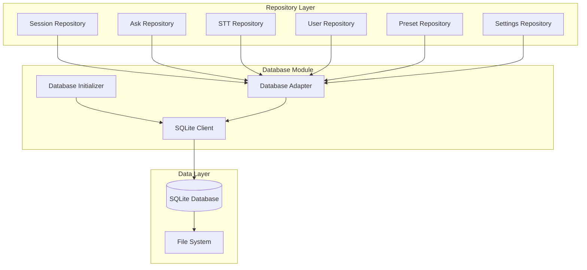

# Database Module - Design Document

## Overview

The Database module implements a robust local data persistence layer using SQLite with a repository pattern for clean data access. It provides automatic schema management, data migration, and ensures data integrity while maintaining user privacy through local-only storage.

## Architecture

### Component Structure



### Database Schema Design

#### Core Tables Structure

```sql
-- User management
CREATE TABLE users (
    uid TEXT PRIMARY KEY,
    email TEXT,
    name TEXT,
    created_at DATETIME DEFAULT CURRENT_TIMESTAMP,
    updated_at DATETIME DEFAULT CURRENT_TIMESTAMP
);

-- Session tracking
CREATE TABLE sessions (
    id INTEGER PRIMARY KEY AUTOINCREMENT,
    user_id TEXT NOT NULL,
    type TEXT NOT NULL CHECK (type IN ('ask', 'listen')),
    title TEXT,
    status TEXT DEFAULT 'active' CHECK (status IN ('active', 'ended')),
    created_at DATETIME DEFAULT CURRENT_TIMESTAMP,
    ended_at DATETIME,
    FOREIGN KEY (user_id) REFERENCES users(uid)
);

-- AI conversations
CREATE TABLE ai_messages (
    id INTEGER PRIMARY KEY AUTOINCREMENT,
    session_id INTEGER NOT NULL,
    role TEXT NOT NULL CHECK (role IN ('user', 'assistant', 'system')),
    content TEXT NOT NULL,
    created_at DATETIME DEFAULT CURRENT_TIMESTAMP,
    FOREIGN KEY (session_id) REFERENCES sessions(id) ON DELETE CASCADE
);

-- Audio transcripts
CREATE TABLE transcripts (
    id INTEGER PRIMARY KEY AUTOINCREMENT,
    session_id INTEGER NOT NULL,
    speaker TEXT NOT NULL,
    text TEXT NOT NULL,
    created_at DATETIME DEFAULT CURRENT_TIMESTAMP,
    FOREIGN KEY (session_id) REFERENCES sessions(id) ON DELETE CASCADE
);

-- User presets
CREATE TABLE presets (
    id INTEGER PRIMARY KEY AUTOINCREMENT,
    user_id TEXT NOT NULL,
    title TEXT NOT NULL,
    prompt TEXT NOT NULL,
    created_at DATETIME DEFAULT CURRENT_TIMESTAMP,
    FOREIGN KEY (user_id) REFERENCES users(uid)
);

-- Application settings
CREATE TABLE settings (
    id INTEGER PRIMARY KEY AUTOINCREMENT,
    user_id TEXT NOT NULL,
    key TEXT NOT NULL,
    value TEXT,
    updated_at DATETIME DEFAULT CURRENT_TIMESTAMP,
    FOREIGN KEY (user_id) REFERENCES users(uid),
    UNIQUE(user_id, key)
);
```

### Database Initializer

#### DatabaseInitializer Class
Manages database lifecycle and ensures proper initialization.

**Key Responsibilities:**
- Database file creation and location management
- Schema synchronization and migration
- Default data initialization
- Connection management
- Recovery and repair operations

**Initialization Flow:**
1. Determine database file location (userData directory)
2. Check if database exists, create if needed
3. Connect to database and validate schema
4. Run migrations if schema updates required
5. Initialize default data (users, presets, etc.)
6. Verify database integrity

### SQLite Client

#### SQLiteClient Class
Low-level database operations and connection management.

**Features:**
- Connection pooling and management
- Prepared statement caching
- Transaction support
- Query optimization
- Error handling and recovery

**Key Methods:**
```javascript
class SQLiteClient {
    connect(dbPath)
    initTables()
    synchronizeSchema()
    initDefaultData()
    cleanupEmptySessions()
    close()
}
```

### Repository Pattern Implementation

#### Base Repository
Abstract base class providing common CRUD operations.

```javascript
class BaseRepository {
    constructor(tableName, client) {
        this.tableName = tableName;
        this.client = client;
    }
    
    async create(data)
    async getById(id)
    async update(id, data)
    async delete(id)
    async findAll(conditions)
}
```

#### Specific Repository Implementations

**Session Repository:**
- Session lifecycle management
- Session type handling (ask/listen)
- Session cleanup and archival
- Active session tracking

**Ask Repository:**
- AI message storage and retrieval
- Conversation history management
- Message search and filtering
- Bulk message operations

**STT Repository:**
- Transcript storage with speaker identification
- Real-time transcript updates
- Transcript search and analysis
- Speaker management

**User Repository:**
- User profile management
- Default user creation
- User preference storage
- Account management

**Preset Repository:**
- Preset CRUD operations
- Template management
- Preset sharing and export
- Category organization

### Database Adapter Layer

#### Adapter Pattern for User Context
Provides user context injection for multi-user support.

```javascript
class DatabaseAdapter {
    constructor(repository, authService) {
        this.repository = repository;
        this.authService = authService;
    }
    
    async create(data) {
        const userId = this.authService.getCurrentUserId();
        return this.repository.create({ ...data, user_id: userId });
    }
}
```

### Schema Management

#### Migration System
Handles database schema evolution and data migration.

**Migration Strategy:**
1. Version-based schema tracking
2. Incremental migration scripts
3. Rollback capability for failed migrations
4. Data preservation during schema changes
5. Validation after migration completion

**Migration Example:**
```javascript
const migrations = {
    '1.0.0': {
        up: async (db) => {
            await db.exec('ALTER TABLE sessions ADD COLUMN title TEXT');
        },
        down: async (db) => {
            // Rollback logic
        }
    }
};
```

### Performance Optimizations

#### Query Optimization
- Indexed columns for frequent queries
- Prepared statement caching
- Batch operations for bulk inserts
- Connection pooling for concurrent access

#### Memory Management
- Lazy loading for large datasets
- Pagination for query results
- Connection cleanup and resource management
- Garbage collection optimization

#### Storage Optimization
- Database file compression
- Automatic cleanup of old data
- Efficient data types and constraints
- Regular database maintenance

## Data Security

### Encryption Strategy
- File-level encryption for sensitive data
- API key encryption using Electron's safeStorage
- In-memory encryption for temporary data
- Secure deletion of sensitive information

### Access Control
- File system permissions for database files
- User context validation for all operations
- Audit logging for sensitive operations
- Data isolation between users

### Privacy Protection
- Local-only data storage
- No external data transmission
- User control over data retention
- Complete data export and deletion options

## Error Handling and Recovery

### Error Categories
1. **Connection Errors**: Database file access, permission issues
2. **Schema Errors**: Migration failures, corruption detection
3. **Data Errors**: Constraint violations, referential integrity
4. **Performance Errors**: Query timeouts, memory exhaustion

### Recovery Mechanisms
- Automatic database repair for minor corruption
- Schema rollback for failed migrations
- Data backup and restore capabilities
- Graceful degradation for non-critical failures

### Monitoring and Diagnostics
- Database health monitoring
- Performance metrics collection
- Error logging and reporting
- Automated maintenance tasks