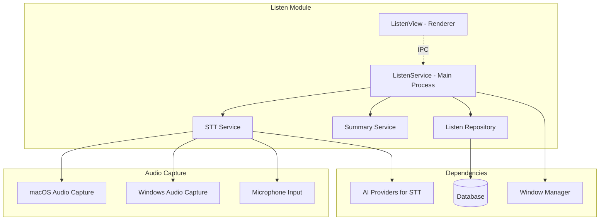

# Listen Feature Module - Design Document

## Overview

The Listen feature module provides comprehensive audio capture and speech-to-text functionality through a layered architecture. It consists of the ListenService (main process), STT services, and ListenView (renderer process), with integration to audio capture systems and conversation analysis.

## Architecture

### Component Structure



### Service Layer Design

#### ListenService Class
Central orchestrator for all audio capture and processing functionality.

**Key Responsibilities:**
- Audio session lifecycle management
- STT service coordination
- Conversation data persistence
- UI state synchronization

**State Management:**
```javascript
{
    currentSessionId: number,
    isInitializingSession: boolean,
    sttService: SttService,
    summaryService: SummaryService
}
```

#### STT Service Architecture
Handles speech-to-text processing with multiple provider support.

**Features:**
- Real-time audio streaming
- Multiple STT provider integration
- Speaker identification
- Language configuration
- Retry logic with fallback providers

#### Summary Service Integration
Provides conversation analysis and insights.

**Capabilities:**
- Real-time conversation tracking
- AI-powered analysis
- Conversation summarization
- Insight generation

### Audio Capture System

#### Platform-Specific Implementation

**macOS Audio Capture:**
- Native screencapture integration
- Loopback audio support
- System audio routing
- Permission handling

**Windows Audio Capture:**
- Native loopback audio APIs
- Desktop capturer integration
- Audio session management
- Device enumeration

**Cross-Platform Microphone:**
- WebRTC audio capture
- Noise cancellation
- Automatic gain control
- Echo cancellation

### Data Flow

#### Audio Processing Pipeline
1. User initiates listening session
2. ListenService initializes audio capture
3. Audio data streams to STT service
4. STT service processes and transcribes
5. Transcriptions saved to database
6. Real-time updates sent to UI
7. Summary service analyzes conversation
8. Session finalized on user stop

#### Session Lifecycle
1. **Initialize**: Create database session, start audio capture
2. **Active**: Process audio, generate transcriptions, update UI
3. **Finalize**: Stop audio, save final data, generate summary
4. **Cleanup**: Release resources, update session status

## Error Handling

### Audio Capture Errors
- **Permission Denied**: Guide user through permission setup
- **Device Unavailable**: Fallback to alternative audio sources
- **Capture Failure**: Retry with different capture methods
- **Quality Issues**: Adjust capture parameters automatically

### STT Processing Errors
- **Network Failures**: Queue audio for retry when connection restored
- **API Limits**: Switch to alternative STT providers
- **Recognition Failures**: Indicate low confidence to user
- **Language Mismatches**: Auto-detect or prompt for language selection

### Recovery Strategies
- **Graceful Degradation**: Continue with reduced functionality
- **Automatic Retry**: Exponential backoff for transient failures
- **User Notification**: Clear feedback on error states
- **State Recovery**: Restore session after error resolution

## Performance Optimizations

### Audio Processing
- **Streaming Architecture**: Process audio in real-time chunks
- **Buffer Management**: Efficient memory usage for audio data
- **Compression**: Optimize audio data for network transmission
- **Latency Reduction**: Minimize delay between speech and transcription

### Resource Management
- **Connection Pooling**: Reuse STT service connections
- **Memory Cleanup**: Automatic cleanup of processed audio data
- **CPU Optimization**: Efficient audio processing algorithms
- **Battery Optimization**: Reduce power consumption during capture

## Security and Privacy

### Data Protection
- **Local Processing**: Audio data processed locally when possible
- **Encrypted Transmission**: Secure communication with STT services
- **Temporary Storage**: Audio data cleared after processing
- **User Control**: Options to disable audio capture

### Privacy Features
- **Permission Management**: Granular audio permission control
- **Data Retention**: Configurable transcription storage duration
- **Anonymization**: Option to remove speaker identification
- **Audit Trail**: Logging of audio access and processing