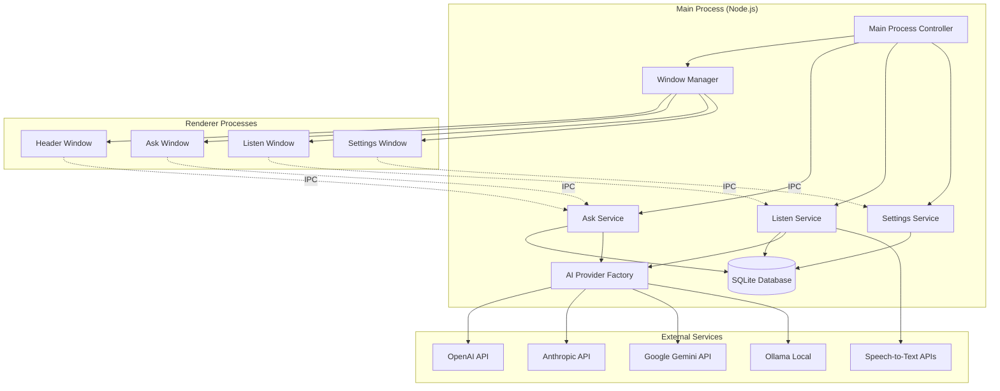

# OA Coder Desktop Application - Design Document

## Overview

OA Coder is architected as a multi-window Electron desktop application that provides AI-powered productivity assistance through a modular, service-oriented design. The application follows a layered architecture with clear separation between the main process (Node.js backend), renderer processes (frontend UI), and data persistence layer.

### Key Design Principles

- **Modular Architecture**: Feature-based organization with clear boundaries
- **Service-Oriented Design**: Core functionality exposed through service classes
- **Event-Driven Communication**: Loose coupling between components via event bridges
- **Multi-Provider AI Integration**: Unified interface for different AI services
- **Local-First Data**: SQLite database for privacy and offline capability
- **Cross-Platform Compatibility**: Native desktop experience on Windows, macOS, and Linux

## Architecture

### High-Level System Architecture



### Process Architecture

The application uses Electron's multi-process architecture:

1. **Main Process**: Manages application lifecycle, window creation, and core services
2. **Renderer Processes**: Handle UI rendering and user interactions
3. **Bridge Layer**: Facilitates secure communication between main and renderer processes

## Components and Interfaces

### Core Services

#### 1. Ask Service (`askService.js`)
Handles AI chat interactions and screenshot capture.

**Key Responsibilities:**
- Process user messages and route to appropriate AI providers
- Capture and process screenshots for visual context
- Manage streaming responses from AI services
- Handle conversation state and session management

**Interface:**
```javascript
class AskService {
    async sendMessage(userPrompt, conversationHistory)
    async toggleAskButton(inputScreenOnly)
    async closeAskWindow()
    async captureScreenshot(options)
}
```

#### 2. Listen Service (`listenService.js`)
Manages audio capture and speech-to-text functionality.

**Key Responsibilities:**
- Initialize and manage audio capture sessions
- Process audio through speech-to-text services
- Handle conversation transcription and storage
- Manage session lifecycle for listening mode

**Interface:**
```javascript
class ListenService {
    async initializeSession(language)
    async closeSession()
    async sendMicAudioContent(data, mimeType)
    async startMacOSAudioCapture()
    getCurrentSessionData()
}
```

#### 3. Settings Service (`settingsService.js`)
Handles application configuration and user preferences.

**Key Responsibilities:**
- Manage user settings and preferences
- Handle API key storage and validation
- Manage presets and templates
- Control window behavior and appearance

**Interface:**
```javascript
const settingsService = {
    async getSettings()
    async saveSettings(settings)
    async saveApiKey(apiKey, provider)
    async getPresets()
    async createPreset(title, prompt)
}
```

### Window Management System

#### Window Manager (`windowManager.js`)
Centralized window lifecycle management with smooth animations and positioning.

**Features:**
- Multi-window coordination
- Smooth movement animations
- Window state persistence
- Cross-platform positioning
- Memory-efficient window pooling

#### Window Types:
1. **Header Window**: Main control interface
2. **Ask Window**: AI chat interface
3. **Listen Window**: Audio capture interface
4. **Settings Window**: Configuration panel

### Data Layer

#### Database Architecture
SQLite-based local storage with repository pattern for data access.

**Schema Design:**
```sql
-- Core entities
users (uid, email, name, created_at, updated_at)
sessions (id, user_id, type, title, status, created_at, ended_at)
ai_messages (id, session_id, role, content, created_at)
transcripts (id, session_id, speaker, text, created_at)
presets (id, user_id, title, prompt, created_at)
settings (id, user_id, key, value, updated_at)
```

#### Repository Pattern
Each data entity has a dedicated repository for database operations:

- `sessionRepository`: Session lifecycle management
- `askRepository`: AI message storage
- `sttRepository`: Transcript management
- `settingsRepository`: Configuration persistence
- `userRepository`: User profile management

### AI Integration Layer

#### AI Provider Factory
Unified interface for multiple AI services with provider-specific implementations.

**Supported Providers:**
- OpenAI (GPT models)
- Anthropic (Claude models)
- Google (Gemini models)
- Ollama (Local models)

**Provider Interface:**
```javascript
class AIProvider {
    async streamChat(messages, options)
    async validateApiKey(apiKey)
    getAvailableModels()
}
```

#### Model State Service
Centralized management of AI model configuration and API keys.

**Features:**
- Secure API key storage
- Model selection and validation
- Provider switching
- Configuration persistence

## Data Models

### Session Model
```javascript
{
    id: number,
    userId: string,
    type: 'ask' | 'listen',
    title: string,
    status: 'active' | 'ended',
    createdAt: Date,
    endedAt: Date
}
```

### AI Message Model
```javascript
{
    id: number,
    sessionId: number,
    role: 'user' | 'assistant' | 'system',
    content: string,
    createdAt: Date
}
```

### Transcript Model
```javascript
{
    id: number,
    sessionId: number,
    speaker: string,
    text: string,
    createdAt: Date
}
```

### User Settings Model
```javascript
{
    profile: string,
    language: string,
    keybinds: object,
    apiKeys: object,
    windowPreferences: object,
    contentProtection: boolean
}
```

## Error Handling

### Error Categories

1. **Network Errors**: API connectivity issues, timeout handling
2. **Authentication Errors**: Invalid API keys, quota exceeded
3. **Database Errors**: Connection failures, constraint violations
4. **System Errors**: Permission denied, resource unavailable
5. **User Input Errors**: Invalid configuration, malformed requests

### Error Handling Strategy

```javascript
// Service-level error handling
try {
    const result = await aiProvider.streamChat(messages);
    return { success: true, data: result };
} catch (error) {
    console.error('[Service] Operation failed:', error);
    
    if (error.code === 'NETWORK_ERROR') {
        return { success: false, error: 'Connection failed. Please check your internet connection.' };
    } else if (error.code === 'AUTH_ERROR') {
        return { success: false, error: 'Invalid API key. Please check your configuration.' };
    }
    
    return { success: false, error: 'An unexpected error occurred.' };
}
```

### Graceful Degradation

- **Offline Mode**: Core functionality available without internet
- **Fallback Providers**: Automatic switching when primary provider fails
- **Local Storage**: Data persistence during network outages
- **Recovery Mechanisms**: Automatic retry with exponential backoff

## Testing Strategy

### Unit Testing
- Service layer business logic
- Repository data access methods
- AI provider implementations
- Utility functions and helpers

### Integration Testing
- Database operations and migrations
- API provider integrations
- IPC communication between processes
- Window management workflows

### End-to-End Testing
- Complete user workflows (ask, listen, settings)
- Multi-window interactions
- Session persistence and recovery
- Cross-platform compatibility

### Testing Tools
- **Jest**: Unit and integration testing framework
- **Spectron**: Electron application testing
- **Mock Services**: AI provider and database mocking
- **Automated Screenshots**: Visual regression testing

### Test Coverage Goals
- Service layer: 90%+ coverage
- Repository layer: 95%+ coverage
- Critical paths: 100% coverage
- Error handling: 85%+ coverage

## Security Considerations

### Data Protection
- **API Key Encryption**: Secure storage using Electron's safeStorage
- **Local Database**: SQLite with file-level permissions
- **Memory Protection**: Sensitive data cleared after use
- **Content Protection**: Optional screen recording prevention

### Network Security
- **HTTPS Only**: All external API communications
- **Certificate Validation**: Strict SSL/TLS verification
- **Request Sanitization**: Input validation and sanitization
- **Rate Limiting**: Prevent API abuse and quota exhaustion

### Privacy Features
- **Local-First**: All data stored locally by default
- **No Telemetry**: No usage tracking or analytics
- **User Control**: Complete data ownership and export
- **Stealth Mode**: Enhanced privacy for sensitive environments

## Performance Optimization

### Memory Management
- **Window Pooling**: Reuse renderer processes
- **Lazy Loading**: Load components on demand
- **Garbage Collection**: Proactive memory cleanup
- **Resource Monitoring**: Track and optimize memory usage

### Database Performance
- **Connection Pooling**: Efficient database connections
- **Query Optimization**: Indexed queries and prepared statements
- **Batch Operations**: Reduce database round trips
- **Background Cleanup**: Periodic maintenance tasks

### UI Responsiveness
- **Streaming Responses**: Real-time AI response display
- **Smooth Animations**: Hardware-accelerated transitions
- **Background Processing**: Non-blocking operations
- **Progressive Loading**: Incremental content loading

## Deployment Architecture

### Build System
- **Electron Builder**: Cross-platform packaging
- **Code Signing**: Trusted application distribution
- **Auto-Updates**: Seamless version management
- **Asset Optimization**: Minimized bundle size

### Distribution Strategy
- **Direct Download**: Standalone installers
- **Auto-Update Server**: Centralized update distribution
- **Platform-Specific**: Native installers for each OS
- **Portable Versions**: No-install execution options

### Development Workflow
- **Hot Reload**: Real-time development updates
- **Source Maps**: Debugging support
- **Environment Configuration**: Development/production modes
- **Automated Testing**: CI/CD integration