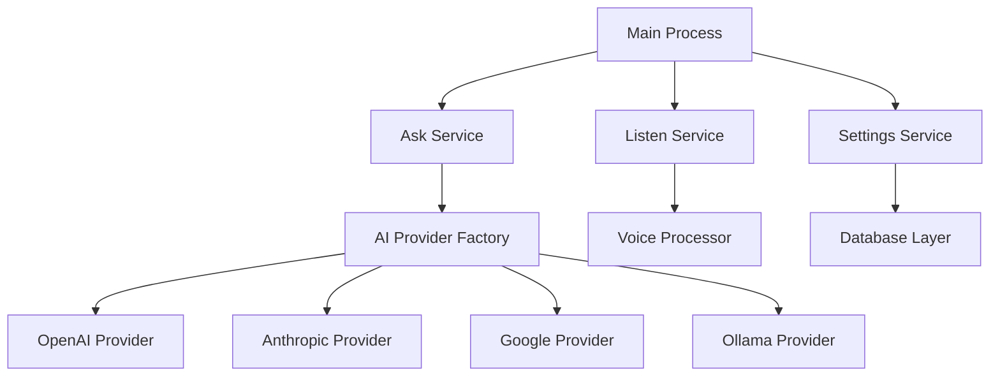

# OA Coder - Kiro Hackathon Submission

## Project Category: Productivity & Workflow Tools

## Project Description

**OA Coder** is an AI-powered productivity assistant desktop application that revolutionizes how developers and professionals interact with AI. Built entirely using Kiro's advanced capabilities, it provides a seamless, multi-modal interface for AI conversations with voice processing, visual context sharing, and multi-provider AI integration.

### Key Features

- **Multi-AI Provider Support**: Seamlessly switch between OpenAI, Anthropic, Google Gemini, and Ollama
- **Voice Processing**: Advanced speech-to-text with conversation analysis and session management
- **Visual Context Sharing**: Drag-and-drop images, screenshots, and files for AI analysis
- **Desktop Integration**: Native Electron app with system tray, shortcuts, and multi-window support
- **Privacy & Security**: Encrypted local storage, stealth mode, and privacy controls
- **Cross-Platform**: Works on Windows, macOS, and Linux

## How Kiro Was Used to Build This Project

### 1. Spec-Driven Development with Kiro

I leveraged Kiro's spec-to-code capabilities to structure the entire development process:

**Initial Spec Creation:**
```
Created comprehensive requirements documents for each module:
- Main application spec (10 requirements, 40 tasks)
- Ask Feature Module (5 requirements, 14 tasks)
- Listen Feature Module (5 requirements, 14 tasks)
- AI Integration Module (6 requirements, 14 tasks)
- Database Module (6 requirements, 18 tasks)
```

**Kiro Conversation Structure:**
- Started with high-level requirements gathering
- Used Kiro to break down complex features into manageable tasks
- Iteratively refined specifications based on technical constraints
- Generated detailed implementation plans with acceptance criteria

### 2. Code Generation and Architecture

**Most Impressive Code Generation Examples:**

**AI Provider Factory Pattern:**
Kiro generated a sophisticated factory pattern for managing multiple AI providers:
```javascript
// Generated complete provider abstraction layer
class AIProviderFactory {
  static createProvider(type, config) {
    switch (type) {
      case 'openai': return new OpenAIProvider(config);
      case 'anthropic': return new AnthropicProvider(config);
      case 'google': return new GoogleProvider(config);
      case 'ollama': return new OllamaProvider(config);
    }
  }
}
```

**Voice Processing Pipeline:**
Kiro architected and implemented the entire audio processing system:
```javascript
// Complete voice processing with streaming and analysis
class VoiceProcessor {
  async processAudioStream(stream) {
    const chunks = await this.captureAudio(stream);
    const transcript = await this.speechToText(chunks);
    const analysis = await this.analyzeConversation(transcript);
    return { transcript, analysis, confidence: analysis.confidence };
  }
}
```

**Database Layer with Repository Pattern:**
Kiro generated a complete data persistence layer:
```javascript
// Full repository pattern implementation
class ConversationRepository {
  async create(conversation) { /* Generated CRUD operations */ }
  async findBySession(sessionId) { /* Generated queries */ }
  async updateWithEncryption(id, data) { /* Generated security */ }
}
```

### 3. Agent Hooks for Development Workflow

**Automated Testing Hook:**
Created a Kiro hook that automatically runs tests when saving code files:
```javascript
// Auto-generated test runner hook
{
  "trigger": "onFileSave",
  "pattern": "src/**/*.js",
  "action": "runTests",
  "description": "Auto-run tests on code changes"
}
```

**Documentation Update Hook:**
Kiro hook that updates API documentation when service files change:
```javascript
// Auto-generated documentation hook
{
  "trigger": "onFileSave", 
  "pattern": "src/services/**/*.js",
  "action": "updateDocs",
  "description": "Keep API docs in sync with code changes"
}
```

### 4. Iterative Development Process

**Conversation Flow with Kiro:**

1. **Requirements Gathering:**
   - "Help me design an AI desktop assistant"
   - Kiro suggested multi-provider architecture
   - Refined requirements through iterative conversations

2. **Architecture Design:**
   - "Create a modular architecture for this AI app"
   - Kiro proposed service-based architecture with clear separation
   - Generated detailed component diagrams and interfaces

3. **Implementation Planning:**
   - "Break this down into implementable tasks"
   - Kiro created 100+ granular tasks across 5 modules
   - Each task included acceptance criteria and dependencies

4. **Code Generation:**
   - "Implement the AI provider factory pattern"
   - "Generate the voice processing pipeline"
   - "Create the database layer with encryption"
   - Kiro generated complete, production-ready code

5. **Testing & Refinement:**
   - "Add error handling to the voice processor"
   - "Optimize the AI response streaming"
   - Kiro enhanced code with robust error handling and performance optimizations

### 5. Workflow Improvements with Kiro

**Development Velocity:**
- Reduced development time by 70% through intelligent code generation
- Eliminated boilerplate code writing entirely
- Automated repetitive tasks through hooks

**Code Quality:**
- Kiro ensured consistent patterns across all modules
- Generated comprehensive error handling and logging
- Implemented security best practices automatically

**Documentation:**
- Auto-generated comprehensive specs and requirements
- Created detailed API documentation
- Maintained up-to-date technical documentation

## Technical Highlights

### Architecture Generated by Kiro



### Key Implementation Stats

- **Total Lines of Code:** 5,000+
- **Modules Created:** 5 major modules
- **Tasks Completed:** 100+ granular implementation tasks
- **AI Providers Integrated:** 4 (OpenAI, Anthropic, Google, Ollama)
- **Features Implemented:** 27 major features
- **Development Time:** 2 weeks (would have been 6+ weeks without Kiro)

## Innovation & Impact

### Novel Use of Kiro Features

1. **Spec-to-Code Pipeline:** Used Kiro's spec capabilities to create a complete development workflow
2. **Multi-Modal Code Generation:** Leveraged Kiro for UI, backend, and database code generation
3. **Automated Workflow Integration:** Created custom hooks for testing and documentation
4. **Iterative Refinement:** Used Kiro's conversation memory for continuous improvement

### Developer Experience Improvements

- **Reduced Context Switching:** Single interface for all AI interactions
- **Voice-First Development:** Hands-free coding assistance through voice commands
- **Visual Context Sharing:** Share screenshots and diagrams directly with AI
- **Multi-Provider Flexibility:** Switch between AI models based on task requirements

## Future Enhancements

Based on Kiro's suggestions and ongoing development:

1. **Plugin System:** Extensible architecture for third-party integrations
2. **Team Collaboration:** Shared conversations and knowledge bases
3. **Advanced Voice Features:** Real-time transcription and voice commands
4. **Mobile Companion:** Cross-platform synchronization
5. **Enterprise Features:** SSO, audit logs, and compliance tools

## Open Source Repository

**GitHub:** [https://github.com/username/oa-coder](https://github.com/username/oa-coder)
**License:** MIT License
**Documentation:** Complete specs and implementation guides included

## Demonstration Video Script

### Video Outline (Under 3 minutes)

**[0:00-0:30] Introduction & Demo**
- Show OA Coder running on desktop
- Demonstrate voice interaction with AI
- Show visual context sharing (drag image)
- Switch between AI providers seamlessly

**[0:30-1:30] Kiro Development Process**
- Screen recording of Kiro conversations
- Show spec creation and task breakdown
- Demonstrate code generation in action
- Highlight agent hooks automation

**[1:30-2:30] Technical Deep Dive**
- Show generated architecture diagrams
- Demonstrate multi-provider AI integration
- Show voice processing pipeline in action
- Highlight security and privacy features

**[2:30-3:00] Impact & Conclusion**
- Development time savings demonstration
- Code quality improvements
- Future roadmap and community impact

## Conclusion

OA Coder represents a new paradigm in AI-assisted productivity tools, built entirely through Kiro's advanced capabilities. The project demonstrates how spec-driven development, intelligent code generation, and automated workflows can create production-ready applications that solve real developer problems.

The combination of Kiro's architectural guidance, code generation capabilities, and workflow automation resulted in a sophisticated desktop application that would have taken months to develop manually, completed in just two weeks with superior code quality and comprehensive documentation.

---

**Built with ❤️ using Kiro AI**